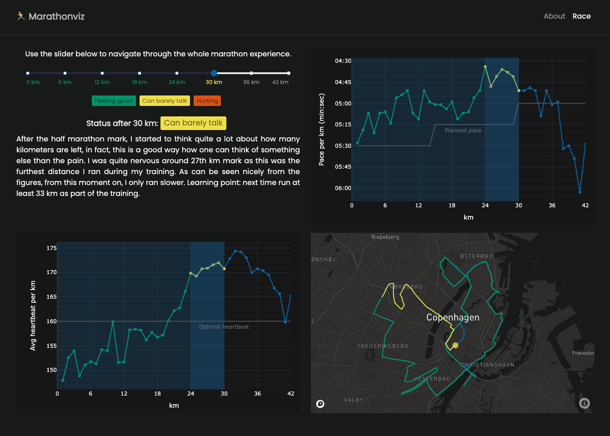

## About
**Marathonviz** is my effort to communicate my experience of running marathon
through an interactive data visualization.



## Journey to marathonviz
### Data
#### Connecting to Strava API
I decided to use Strava's API to get my detailed data about the marathon race.
I could alternatively ask Strava to give me all my personal data, but the
problem is that they only give you summaries of your activities and not details
like pace per km. In a cube, connecting to Strava API is fairly straightforward
and it does not introduce any further limitations.

I followed [this](https://towardsdatascience.com/using-the-strava-api-and-pandas-to-explore-your-activity-data-d94901d9bfde) tutorial to obtain `REFRESH_TOKEN`, `CLIENT_SECRET` and `CLIENT_ID` which I then saved into the [config file](src/utils/config.py).

#### Fetching the Strava data
To obtain the data, I created a simple pipeline which can be called through `CLI`:

```
cd src
python cli.py -FT
```

For details, check the pipeline [file](src/utils/strava_api.py).

#### Processing the Strava data
In the preprocessing part, I have two main things:

1. Decoded coordinates and estimated distance between them using `Haversine`
   library. (see the [result](src/data/processed/coordinates.csv))

2. For each km, I estimated its coordinates and then added this to the each km
   detail. (see the [result](src/data/processed/ithkm.csv))

These two tasks were embedded into a simple [pipeline](src/utils/preprocessing.py) which can be called through `CLI`:

```
cd src
python cli.py -PRE
```

### Visualization
I explain my main visualization choices in [the presentation](https://docs.google.com/presentation/d/1E3R6Nys0IiegZCQ_d7zTT1UQQXSPCm9kwWC9CsgxLC8/edit?usp=sharing) (See comments for each slide) as well as in the [report](report.pdf). To make things happen, I used [plotly and dash](https://plotly.com/). I deployed the `Dash web app` using [digital ocean](https://www.digitalocean.com/) - see this [turorial](https://www.digitalocean.com/community/tutorials/how-to-serve-flask-applications-with-gunicorn-and-nginx-on-ubuntu-18-04) for detail.

